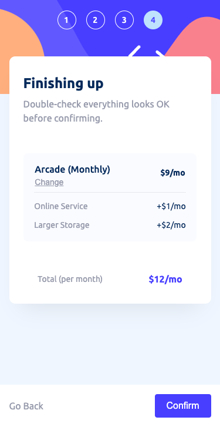
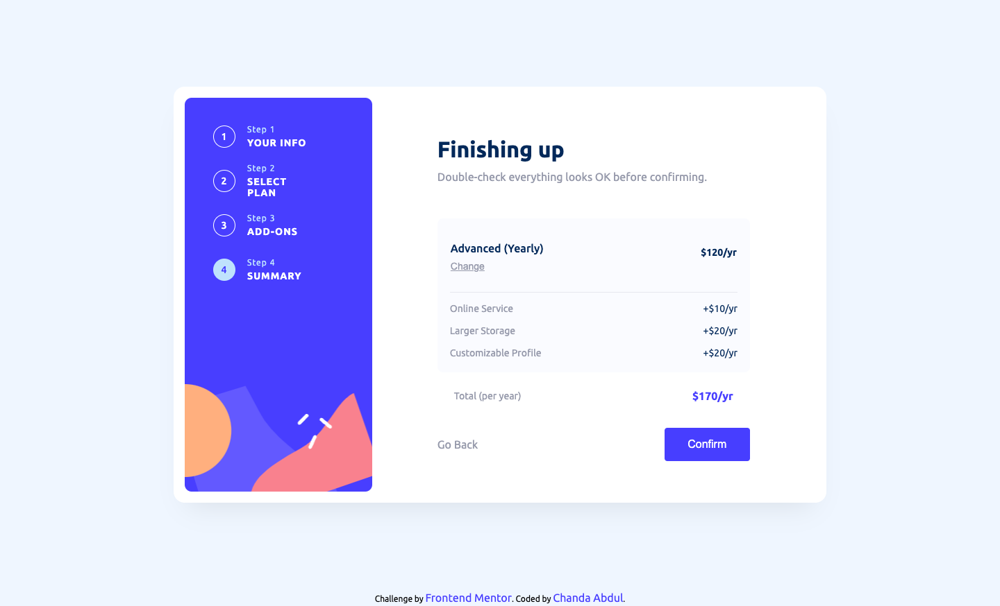

# Frontend Mentor - Multi-step Form solution


This is a solution to the [Multi-step form challenge on Frontend Mentor](https://www.frontendmentor.io/challenges/multistep-form-YVAnSdqQBJ). Frontend Mentor challenges help you improve your coding skills by building realistic projects. 
# Frontend Mentor - Multi-step form


## Table of contents

- [Overview](#overview)
  - [The challenge](#the-challenge)
  - [Screenshots](#screenshots)
  - [Links](#links)
- [My process](#my-process)
  - [Built with](#built-with)
  - [What I learned](#what-i-learned)
  - [Continued development](#continued-development)
  - [Useful resources](#useful-resources)
- [Author](#author)

## Overview

### The challenge

Users should be able to:

- [x] Complete each step of the sequence
- [x] See a summary of their selections on the final step and confirm their order
- [x] View the optimal layout for the interface depending on their device's screen size
- [x] See hover and focus states for all interactive elements on the page

## Screenshots
<details>
<summary><b> Mobile Screenshots @ 375px</b></summary>

### Step 1


### Step 2


### Step 3


### Step 4


### Confirmation


</details>

<details>
<summary><b> Desktop Screenshots @ 1440px</b></summary>

### Step 1


### Step 2


### Step 3


### Step 4


### Confirmation


</details>

### Links

<b>Solution URL:</b> [here](https://github.com/Chanda-Abdul/Angular-Multi-step-form) | <b>Live Site URL:</b>
<!-- [Add live site URL here](https://your-live-site-url.com) -->

## My process

### Built with


### What I learned

<!-- Use this section to recap over some of your major learnings while working through this project. Writing these out and providing code samples of areas you want to highlight is a great way to reinforce your own knowledge. -->

<!-- To see how you can add code snippets, see below:

```html
<h1>Some HTML code I'm proud of</h1>
```
```css
.proud-of-this-css {
  color: papayawhip;
}
```
```js
const proudOfThisFunc = () => {
  console.log('🎉')
}
``` -->


### Continued development

<!-- Use this section to outline areas that you want to continue focusing on in future projects. These could be concepts you're still not completely comfortable with or techniques you found useful that you want to refine and perfect. -->


### Useful resources
- [ Split an Angular Reactive Form model into child components ](https://youtu.be/2DOkiQFB5ic) - This helped me for XYZ reason. I really liked this pattern and will use it going forward.
- [ Material Button toggle](https://material.angular.io/components/button-toggle/overview) - This helped me for XYZ reason. I really liked this pattern and will use it going forward. `<mat-button-toggle>` are on/off toggles with the appearance of a button. 
- [ Material Checkbox](https://material.angular.io/components/checkbox/overview) - This is an amazing article which helped me finally understand XYZ. I'd recommend it to anyone still learning this concept.`<mat-checkbox>` provides the same functionality as a native `<input type="checkbox">` enhanced with Material Design styling and animations.

- [ Creating a Custom @NgModule for Material Components in Angular](https://armno.medium.com/creating-a-custom-material-module-in-angular-ee6a5e925d30) - To keep AppModule clean, we can create another NgModule that takes care of importing Material modules to use. 
- [Example resource 1](https://www.example.com) - This helped me for XYZ reason. I really liked this pattern and will use it going forward.
- [Example resource 2](https://www.example.com) - This is an amazing article which helped me finally understand XYZ. I'd recommend it to anyone still learning this concept.

## Author

- Frontend Mentor - [@Chanda-Abdul](https://www.frontendmentor.io/profile/Chanda-Abdul)
- Website - [Chanda Codes](https://chandacodes.com/)
- GitHub - [github.com/Chanda-Abdul](https://github.com/Chanda-Abdul)

